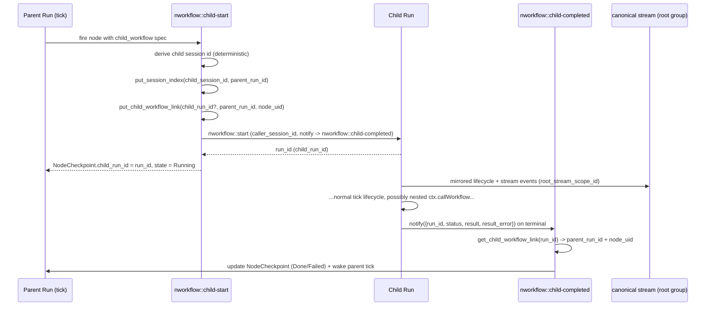

# nworkflow Child Workflow Runs (`ctx.callWorkflow`)

**Status**: Spezifikation v1.0
**Datum**: 2026-09-16
**Ziel**: Ein Workflow soll einen anderen Workflow als vollwertigen, verschachtelbaren Sub-Run starten können, ohne dass Entwickler Parent/Child-Details kennen müssen — Status, State, Stream und UI verhalten sich für den Aufrufer wie bei jedem normalen Run.

---

## 1. Ziel

nworkflow soll `ctx.callWorkflow(...)` als first-class Node-Typ bereitstellen, der einen anderen (oder denselben) registrierten Workflow als **Child-Run** startet, dessen Terminierung abwartet und dessen Ergebnis als normalen Node-Result zurückgibt.

Kernpunkte:

- Ein Node im Parent-Graph kann einen kompletten Sub-Workflow-Run auslösen.
- Der Parent-Node bleibt `Running`, bis der Child-Run terminal ist; danach trägt der Node exakt das Child-Ergebnis (oder den Child-Fehler).
- Verschachtelung ist beliebig tief zulässig (Child ruft selbst wieder `ctx.callWorkflow(...)` auf), begrenzt durch ein bestehendes Sicherheitslimit.
- Ein Entwickler, der den Parent-Run startet, abonniert **einen** Stream (`nworkflow` / `parent_run_id`) und sieht darüber auch alle relevanten Child- und Enkel-Ereignisse — ohne Sonderwissen über Parent/Child.
- Status/State/Traces eines Child-Runs bleiben über die **exakt gleichen** Standard-Funktionen (`nworkflow::status`, `nworkflow::node-result`, Timeline-API) abrufbar, sobald man dessen `run_id` kennt — und diese `run_id` liefert nworkflow direkt am Parent-Node mit.
- Die nvent-UI zeigt Child-Workflow-Nodes als eigenen Blocktyp; ein Klick auf einen solchen Node im Flow Diagram oder in der Timeline öffnet den Child-Run genauso, wie man normalerweise zwischen Runs navigiert.

---

## 2. Anforderungen

### 2.1 Functional Requirements

1. `ctx.callWorkflow(...)` ist aus einem Workflow-Handler heraus aufrufbar und verhält sich wie `ctx.call(...)`: awaitbar, liefert das Ergebnis des Sub-Runs.
2. Ein Child-Run ist ein vollständiger, unabhängiger `WorkflowRunRecord` mit eigener `run_id`, eigenem `def_ref`, eigenem State-Scope — kein geteilter State mit dem Parent.
3. Der auslösende Parent-Node bleibt `Running`, bis der Child-Run terminal ist (`Completed`/`Failed`/`Cancelled`); danach übernimmt der Node-Checkpoint Ergebnis oder Fehler des Child-Runs.
4. Verschachtelung ist rekursiv zulässig (Child → Enkel → Urenkel …), begrenzt durch das bestehende `MAX_WORKFLOW_DEPTH`-Limit.
5. Ein Parent kann denselben Workflow, den er selbst ausführt, erneut aufrufen (Selbstrekursion), solange die Tiefe das Limit nicht überschreitet.
6. Der Parent-Node-Checkpoint trägt die `child_run_id`, damit UI und Standard-APIs (`nworkflow::status`, `nworkflow::node-result`, Timeline) den Child-Run direkt adressieren können.
7. Alle live-relevanten Ereignisse eines Child-Runs (und aller tieferen Nachfahren) werden zusätzlich in den kanonischen Stream des **Root-Runs** gespiegelt, sodass eine einzige Subscription auf den Root-Run genügt.
8. Abbruch des Parent-Runs (`nworkflow::stop`) kaskadiert best-effort auf alle noch laufenden Child-Runs.
9. Löschen des Parent-Runs (`nworkflow::run-delete`, Auto-Cleanup) löscht rekursiv alle Child-Runs, bevor der Parent-Run-Record selbst gelöscht wird.
10. Ein Timeout auf dem Parent-Node (bestehender `pending_timeout_ms`-Mechanismus) markiert den Node als fehlgeschlagen und stößt best-effort einen Stop des Child-Runs an.
11. Die UI zeigt Child-Workflow-Nodes als eigenen, visuell unterscheidbaren Blocktyp im Flow Diagram und in der Run-Overview/Timeline.
12. Ein Klick auf einen Child-Workflow-Node (Flow Diagram) oder dessen Timeline-Eintrag öffnet die Detailansicht des Child-Runs.
13. Ergebnisaufbewahrung (`memory`/`store`) für den Parent-Node folgt derselben, bereits bestehenden generischen Node-Result-Policy wie jeder andere Node.

### 2.2 Non-Goals

- Kein geteilter/gemergter State zwischen Parent und Child (`ctx.workflow.state.*` bleibt run-scoped, exakt wie heute).
- Kein automatisches "Zusammenfassen" von Child-Timelines in die Parent-Timeline — die UI navigiert stattdessen explizit in den Child-Run.
- Kein Fire-and-forget-Modus in v1 (`ctx.callWorkflow` wartet immer auf Terminierung); ein `detached: true`-Modus ist ein möglicher Folgeausbau, aber nicht Teil dieser Spezifikation.
- Kein neues Depth-/Cycle-Tracking-Feld — es wird das bestehende `caller_session_id`-Ketten- und `MAX_WORKFLOW_DEPTH`-Limit aus `start.rs` wiederverwendet.
- Kein neuer physischer Stream-Name und keine geteilte Stream-Gruppe zwischen Parent und Child (Cleanup-Sicherheit, siehe §8).

---

## 3. Grundidee

nworkflow kennt bereits eine Nesting-Schutzvorrichtung: `caller_session_id` auf `WorkflowRunRecord` plus `caller_workflow_depth(...)` in `start.rs`, ursprünglich gedacht für den Fall, dass ein Node selbst `nworkflow::start` aufruft (z. B. über einen Agenten-Tool-Call). `ctx.callWorkflow(...)` ist der **erste first-class Konsument** dieser bereits vorhandenen Infrastruktur:

- Ein Child-Workflow-Node bekommt eine deterministische Node-Session-ID (`ids::child_session_id(parent_run_id, node_uid)`) — exakt dieselbe Hilfsfunktion, die für Agent-Nodes bereits existiert.
- Diese Session-ID wird per `state::put_session_index(...)` reverse-indexiert (`session_id -> parent_run_id`) — exakt derselbe generische Mechanismus wie für Agent-Sessions.
- Der Child-Run wird mit `caller_session_id = <diese Node-Session-ID>` gestartet — dadurch greift `caller_workflow_depth(...)` automatisch und ohne Änderung.
- `MAX_WORKFLOW_DEPTH = 8` (bestehende Konstante in `start.rs`) begrenzt die Verschachtelungstiefe für `ctx.callWorkflow` genauso wie für jeden anderen rekursiven `nworkflow::start`-Aufruf.

Damit ist die Rekursionssicherheit "gratis" — die Spezifikation fügt keine parallele Tiefenlogik hinzu, sondern schließt an das bestehende Sicherheitsnetz an.

Analog zum Agent-Task-Pattern (`AgentTaskRecord`, `agent_session_key`) bekommt der Child-Workflow-Aufruf ein eigenes, schlankes Reverse-Link-Record, damit die asynchrone Terminierungsmeldung des Child-Runs (`notify`-Callback) weiß, welchen Parent-Node sie aktualisieren muss.

---

## 4. API-Design

### 4.1 Workflow-API

```ts
export default defineWorkflow({
  name: 'invoice-pipeline',
  handler: async (input: { orderId: string }, ctx) => {
    const prepared = await ctx.call('prepare-order', input)

    // Kurzform: Node-ID wird automatisch aus der workflowId abgeleitet.
    const invoice = await ctx.callWorkflow('billing::generate-invoice', prepared)

    // Ausführliche Form mit explizitem Node und Optionen.
    const shipped = await ctx.callWorkflow('ship', 'logistics::dispatch-order', invoice, {
      timeoutMs: 60_000,
      result: { returnType: 'store' }
    })

    return shipped
  }
})
```

`ctx.callWorkflow` verhält sich bewusst wie `ctx.call`: gleiche Zwei-/Drei-Arity-Konvention, gleiches awaitbares Ergebnis, gleiche Node-Level-Optionen (`result`, `inputPolicy`, `depends_on`, `fanout` über `ctx.loop`/`ctx.foreach`). Der einzige semantische Unterschied ist, **was** der Node ausführt: statt einer Function oder eines Agenten startet er einen anderen Workflow-Run und wartet auf dessen Terminierung.

### 4.2 Selbstrekursion

```ts
export default defineWorkflow({
  name: 'retry-until-done',
  handler: async (input: { attempt: number, maxAttempts: number }, ctx) => {
    const result = await ctx.call('try-step', input)

    if (!result.done && input.attempt < input.maxAttempts) {
      return ctx.callWorkflow('retry-until-done', {
        ...input,
        attempt: input.attempt + 1
      })
    }

    return result
  }
})
```

Diese Selbstrekursion terminiert spätestens bei `MAX_WORKFLOW_DEPTH` mit einem klaren Fehler, falls `maxAttempts` fehlerhaft konfiguriert wurde.

---

## 5. Proposed Type Shapes

### 5.1 TypeScript: `WorkflowContext.callWorkflow`

```ts
interface ChildWorkflowCallOptions {
  /** Begrenzt nur den Dispatch von nworkflow::start; nutzt sonst den bestehenden
   *  node-level pending-timeout Mechanismus für die gesamte Laufzeit des Child-Runs. */
  timeoutMs?: number

  /** Ergebnisaufbewahrung des Parent-Nodes; identische Semantik wie bei jedem
   *  anderen Node (siehe NodeResultSpec). Default: memory. */
  result?: {
    returnType?: 'memory' | 'store'
    onMemoryFail?: 'store' | 'error'
  }

  /** Input-Transport-Policy des Parent-Nodes; identische Semantik wie bei jedem
   *  anderen Node (siehe NodeInputSpec). Default: memory. */
  inputPolicy?: {
    returnType?: 'memory' | 'store'
    onMemoryFail?: 'store' | 'error'
  }
}

interface WorkflowContext {
  /**
   * Start a child workflow run and await its terminal result.
   *
   * @example
   * await ctx.callWorkflow('billing::generate-invoice', input)
   *
   * @example
   * await ctx.callWorkflow('ship', 'logistics::dispatch-order', input, {
   *   timeoutMs: 60_000
   * })
   */
  callWorkflow: {
    <T = unknown>(workflowId: string, input?: unknown, options?: ChildWorkflowCallOptions): Promise<T>
    <T = unknown>(nodeId: string, workflowId: string, input?: unknown, options?: ChildWorkflowCallOptions): Promise<T>
  }
}
```

`workflowId` ist die registrierte Function-ID des Ziel-Workflows — dieselbe ID, mit der `defineWorkflow(...)` den Workflow als aufrufbare iii-Function registriert (identisch zu dem String, den `useWorkflow().run(workflowId, input)` heute schon verwendet).

### 5.2 Rust: `NodeDef` Erweiterung

```rust
/// Declarative child-workflow specification when this node starts another
/// workflow run and awaits its terminal result.
#[derive(Debug, Clone, PartialEq, Serialize, Deserialize, JsonSchema)]
#[serde(deny_unknown_fields, rename_all = "camelCase")]
pub struct ChildWorkflowSpec {
    /// Registered function id of the target workflow (may equal the running
    /// workflow's own id for self-recursion).
    pub workflow: String,
}

pub struct NodeDef {
    // ...bestehende Felder unverändert...

    /// Declarative child-workflow specification when this node runs a nested
    /// workflow run instead of a function or agent turn.
    #[serde(
        default,
        skip_serializing_if = "Option::is_none",
        rename = "childWorkflow"
    )]
    pub child_workflow: Option<ChildWorkflowSpec>,
}

impl NodeDef {
    pub fn effective_function(&self) -> FunctionSpec {
        if let Some(f) = &self.function {
            f.clone()
        } else if self.agent.is_some() {
            FunctionSpec { id: "harness::spawn".to_string(), /* ... */ }
        } else if self.child_workflow.is_some() {
            FunctionSpec {
                id: "nworkflow::child-start".to_string(),
                timeout_ms: None,
                queue: None,
                engine_retry: None,
                runtime: Some(FunctionRuntime::Unknown),
            }
        } else {
            FunctionSpec { id: "".to_string(), /* ... */ }
        }
    }
}
```

`input`, `depends_on`, `fanout`, `result` und `input_policy` bleiben die bereits bestehenden generischen `NodeDef`-Felder — ein Child-Workflow-Node ist in jeder anderen Hinsicht ein normaler DAG-Node.

### 5.3 Rust: `NodeCheckpoint` Erweiterung

```rust
pub struct NodeCheckpoint {
    // ...bestehende Felder unverändert (state, session_id, turn_id, result_ref, ...)...

    /// Set when this node started a child workflow run; the run_id of that
    /// child run, present for the whole node lifetime (Running through
    /// terminal). Absent for function/agent/queue-backed nodes.
    #[serde(default, skip_serializing_if = "Option::is_none")]
    pub child_run_id: Option<String>,
}
```

`child_run_id` wird **synchron** beim Firen des Nodes gesetzt (aus der `StartResponse` von `nworkflow::start`), analog dazu, wie `session_id` für einen Agent-Node synchron aus `harness::spawn` gesetzt wird. Damit steht die Child-`run_id` sofort in `nworkflow::status` zur Verfügung, ohne dass der Child-Run bereits terminiert sein muss.

### 5.4 Rust: `WorkflowRunRecord` Erweiterung

```rust
pub struct WorkflowRunRecord {
    // ...bestehende Felder unverändert (inkl. caller_session_id)...

    /// Direct parent linkage for UI breadcrumbs and introspection. `None` for
    /// a root run (started by a chat session or a non-workflow caller).
    #[serde(default, skip_serializing_if = "Option::is_none")]
    pub parent_run_id: Option<String>,

    /// The node_uid in `parent_run_id` that started this run via
    /// `ctx.callWorkflow(...)`.
    #[serde(default, skip_serializing_if = "Option::is_none")]
    pub parent_node_uid: Option<String>,

    /// The top-most ancestor run_id in this call chain. `None` when this run
    /// IS the root (equivalent to `parent_run_id.is_none()`), kept as an
    /// explicit field so descendants don't need to walk the chain to find it.
    #[serde(default, skip_serializing_if = "Option::is_none")]
    pub root_run_id: Option<String>,

    /// The root run's `stream_scope_id`. Present iff `root_run_id` is
    /// present. Used as the mirror target for live stream bridging (§7).
    #[serde(default, skip_serializing_if = "Option::is_none")]
    pub root_stream_scope_id: Option<String>,
}
```

Diese vier Felder sind reine Bequemlichkeits-/Introspektionsfelder. Sie werden **einmalig** beim Start des Child-Runs aus dem bereits geladenen Parent-Record abgeleitet (derselbe Parent-Lookup, den `caller_workflow_depth(...)` ohnehin durchführt — keine zusätzliche I/O):

```rust
let (parent_run_id, parent_root_run_id, parent_root_stream_scope_id) = /* aus geladenem Parent-Record */;

let root_run_id = parent_root_run_id.or_else(|| Some(parent_run_id.clone()));
let root_stream_scope_id = parent_root_stream_scope_id
    .or_else(|| parent_record.stream_scope_id.clone());
```

### 5.5 Reverse-Link Record (Completion-Korrelation)

Der `notify`-Callback von `nworkflow::start` liefert beim Terminieren nur `{ run_id, status, result, result_error }` (siehe `events::completed_payload`) — ohne Kontext, welchem Parent-Node dieser `run_id` zugeordnet ist. Analog zum Agent-Task-Pattern (`AgentTaskRecord`, `get_agent_task_by_session`) wird daher ein schlankes Reverse-Link-Record eingeführt:

```rust
#[derive(Debug, Clone, PartialEq, Serialize, Deserialize, JsonSchema)]
pub struct ChildWorkflowLinkRecord {
    pub child_run_id: String,
    pub parent_run_id: String,
    pub parent_node_uid: String,
    pub created_at: i64,
}
```

Persistenz-Vertrag (im selben `WorkflowInternalStateStore`, analog zu `put_agent_task` / `get_agent_task_by_session`):

```rust
async fn put_child_workflow_link(&self, link: &ChildWorkflowLinkRecord) -> Result<(), WorkflowError>;
async fn get_child_workflow_link(&self, child_run_id: &str) -> Result<Option<ChildWorkflowLinkRecord>, WorkflowError>;
async fn delete_child_workflow_link(&self, child_run_id: &str) -> Result<(), WorkflowError>;
async fn list_child_workflow_links_for_run(&self, parent_run_id: &str) -> Result<Vec<ChildWorkflowLinkRecord>, WorkflowError>;
```

`list_child_workflow_links_for_run` wird für die rekursive Cleanup-Kaskade benötigt (§8).

---

## 6. Runtime-Modell

### 6.1 Lifecycle



Der `put_child_workflow_link`-Schritt erfolgt, bevor `nworkflow::start` für das Child aufgerufen wird — die eigentliche `child_run_id` steht dabei noch nicht fest (`nworkflow::start` erzeugt sie intern). Praktisch entsteht der Link daher **direkt nach** der erfolgreichen `StartResponse`, im selben Schritt, in dem auch `NodeCheckpoint.child_run_id` gesetzt wird (in `fire_node`, analog zur bestehenden Agent-Behandlung von `child_session_id` in `tick.rs`). Ein Absturz zwischen `nworkflow::start`-Erfolg und dem Persistieren des Links würde einen verwaisten Child-Run hinterlassen; das bestehende Sweep/Reconcile-Muster (siehe `reconcile.rs`) wird um eine Prüfung erweitert, die einen `NodeCheckpoint` mit `child_run_id`, aber fehlendem Link, beim nächsten Tick nachträgt (idempotent, wie andere Reconcile-Pfade).

### 6.2 Reconcile: Wie der Parent-Node terminiert

Zwei Wege führen dazu, dass ein Parent-Node mit `child_workflow` terminiert — beide sind idempotent und dürfen sich überschneiden:

1. **Push (Normalfall)**: `nworkflow::child-completed` (der `notify`-Handler) lädt den Parent-Run, setzt den `NodeCheckpoint` auf `Done`/`Failed` mit dem Child-Ergebnis/-Fehler, persistiert und weckt den Parent-Tick.
2. **Pull (Reconcile-Fallback)**: Der bestehende `reconcile_function_nodes`-Pfad (der bereits periodisch prüft, ob `Running`-Nodes mit externen Referenzen — Queue-Receipts, Harness-Sessions — inzwischen terminiert sind) wird um einen dritten Fall erweitert: für Nodes mit `child_run_id` wird bei Gelegenheit `nworkflow::status(child_run_id)` geprüft; ist der Child-Run terminal, aber der Parent-`NodeCheckpoint` noch `Running` (verlorene Notify-Zustellung), wird dieselbe Terminierungslogik wie im Push-Fall angewendet.

Dieses Muster entspricht exakt dem bestehenden Verhältnis zwischen `harness::turn-completed`-Events (Push) und dem generischen Reconcile-Pfad (Pull) für Agent-Nodes.

### 6.3 Node-Ergebnis

Beim Terminieren wird das Child-Ergebnis unverändert als Node-Ergebnis übernommen (kein Remapping):

- `status == Completed` → `NodeCheckpoint.state = Done`, `result_ref` verweist auf das (ggf. neu unter dem Parent-Run gespeicherte) Child-Ergebnis gemäß der **Parent-Node**-`result`-Policy.
- `status == Failed` → `NodeCheckpoint.state = Failed`, `result_error` = `"child workflow '<workflow>' (run <child_run_id>) failed: <child result_error>"`.
- `status == Cancelled` → `NodeCheckpoint.state = Cancelled`, `result_error = "child workflow cancelled"`.

---

## 7. Stream-Bridging: Eine Subscription für den ganzen Baum

### 7.1 Anforderung

> Der Entwickler, der den Parent-Workflow startet, soll über die Standard-Schnittstelle (`useWorkflowStream(runId)` / `subscribe({ streamName: 'nworkflow', groupId: runId })`) automatisch alle relevanten Ereignisse aus Child- und Enkel-Runs erhalten — ohne die Existenz von Child-Runs zu kennen.

### 7.2 Entwurf: Root-Stream-Mirroring am kanonischen Publish-Punkt

Jeder Run behält seinen **eigenen** physischen Stream (`stream_scope_id = eigene run_id`) für seine eigenen Ereignisse — das ist unverändert und bleibt die Quelle für `nworkflow::status`/Timeline-Abfragen dieses spezifischen Runs.

Zusätzlich gilt: **Jeder Schreibvorgang** auf den kanonischen `nworkflow`-Stream läuft durch einen einzigen zentralen Punkt (`stream_publish::handle` / `publish_best_effort`, siehe §7.3). Dieser Punkt wird um eine Spiegelung erweitert:

```rust
// Nach dem regulären Schreiben in den eigenen stream_scope_id-Gruppe:
if let Some(root_group) = record.root_stream_scope_id.as_deref() {
    let mirrored_item_id = format!("{item_id}_m"); // eigene, aber ableitbare ID
    let mirrored_payload = json!({
        "type": event_type,
        "data": data,
        "run_id": root_run_id,          // Root-Run — das, worauf der Client abonniert ist
        "origin_run_id": run_id,        // der Run, der das Ereignis tatsächlich erzeugt hat
        "node_path": node_path,         // ["billing-node", "sub-step-node", ...] von Root bis Origin
        "node_uid": node_uid,
        "ts_unix_ms": ts_unix_ms,
    });
    // stream::set auf (stream_name="nworkflow", group_id=root_group, item_id=mirrored_item_id)
}
```

Wichtige Eigenschaften dieses Entwurfs:

- **Einmalige Zentralisierung**: Die Spiegelung passiert an genau einer Stelle (dem bestehenden Publish-Choke-Point), nicht in jedem einzelnen Event-Producer. Neue Event-Typen (z. B. zukünftige `agents.*`-Varianten) werden automatisch mitgespiegelt, ohne Sondercode.
- **Kein geteilter physischer Stream**: Löschen eines Child-Runs löscht ausschließlich Einträge unter dessen **eigener** `stream_scope_id`-Gruppe (unverändert, siehe `delete_run`). Die gespiegelten Kopien im Root-Stream werden erst gelöscht, wenn der **Root-Run** selbst gelöscht wird — was aber gemäß §8 ohnehin bedeutet, dass zu diesem Zeitpunkt alle Nachfahren bereits gelöscht sind.
- **Transitiv bis zur Wurzel**: Da `root_stream_scope_id` bei jedem Kind direkt vom (Groß-)Elternteil geerbt wird (§5.4), spiegelt jede Ebene direkt in die Root-Gruppe — es gibt keine mehrstufige Relay-Kette über Zwischen-Parents, die Reihenfolge/Zustellung gefährden könnte.
- **Rückwärtskompatibel**: Für einen Top-Level-Run ist `root_stream_scope_id` `None` — keine Spiegelung, kein zusätzlicher Overhead, Verhalten bleibt exakt wie heute.
- **`node_path`** erlaubt es der UI, verschachtelte Ereignisse hierarchisch zu gruppieren (z. B. eine eingeklappte "Child: billing::generate-invoice"-Sektion in einer flachen Timeline), ohne dass der Consumer zwingend etwas damit tun muss — ein einfacher Consumer ignoriert `node_path`/`origin_run_id` und sieht einfach eine gemergte, chronologische Ereignisliste.

### 7.3 Bezug zum bestehenden Envelope (Abschnitt 7.3 der Harness-Agent-Spec)

Das `NworkflowStreamEvent`-Envelope wird additiv erweitert:

```ts
interface NworkflowStreamEvent<T = unknown> {
  type: string
  data: T
  run_id: string          // Root-Run — identisch mit der abonnierten group_id
  node_uid?: string
  ts_unix_ms: number

  // Neu, nur bei gespiegelten Ereignissen aus einem Nachfahren-Run gesetzt:
  origin_run_id?: string  // der Run, der das Ereignis tatsächlich erzeugt hat
  node_path?: string[]    // Kette von node_uids von Root bis zum Origin-Run
}
```

Für Ereignisse, die der Root-Run selbst erzeugt, bleiben `origin_run_id`/`node_path` unbesetzt (bzw. `origin_run_id == run_id`, `node_path = []`) — bestehende Consumer, die diese Felder ignorieren, sind unbetroffen.

### 7.4 Developer-DX

```ts
// Ein Subscription-Punkt am Root-Run genügt — Child- und Enkel-Ereignisse
// erscheinen automatisch mit angereichertem origin_run_id / node_path.
const { listen, listenEvents } = useWorkflowStream(parentRunId)

const agentMessages = listenEvents('agents.*')
// agentMessages.value enthält Ereignisse aus dem Parent UND aus jedem
// verschachtelten Child-Run, chronologisch gemischt.
```

Möchte ein Consumer **nur** die Ereignisse eines bestimmten Child-Runs sehen, filtert er clientseitig auf `origin_run_id === childRunId` — oder abonniert alternativ direkt `useWorkflowStream(childRunId)`, was ebenfalls funktioniert (der Child-Run hat ja seinen eigenen, vollständigen physischen Stream). Beide Wege sind gültig; der erste ist der empfohlene Default für "alles in einem Blick", der zweite für eine isolierte Detailansicht (siehe UI, §9).

---

## 8. Cleanup & Recovery

### 8.1 Lösch-Kaskade

Bestehendes Prinzip aus `state::delete_run`: *Kind-Artefakte zuerst, Run-Record zuletzt.* Für Child-Workflow-Runs wird dieses Prinzip eine Ebene höher gezogen — **ganze Nachfahren-Runs sind Kind-Artefakte**:

1. `list_child_workflow_links_for_run(run_id)` laden.
2. Für jeden Link: rekursiv `run_delete::delete_run_by_id(child_run_id)` aufrufen (Tiefe zuerst — ein Child mit eigenen Enkeln löscht diese zuerst).
3. Für jeden noch laufenden Child-Run vor dem Löschen best-effort `nworkflow::stop` senden (bereits Teil von `delete_run_by_id`, keine Änderung nötig).
4. `delete_child_workflow_link(child_run_id)` für jeden verarbeiteten Link.
5. Erst danach die bestehende `delete_run`-Logik für den aktuellen Run ausführen (State, Streams, Def, Results, …).

Diese Reihenfolge ist idempotent: Ein Absturz zwischen Schritt 2 und 4 hinterlässt höchstens einen bereits gelöschten Child mit einem verwaisten Link-Eintrag, der beim nächsten Sweep-Zyklus erneut verarbeitet wird (No-Op, da der Child bereits fehlt).

### 8.2 Auto-Cleanup/Sweep-Integration

Der bestehende Sweep-Mechanismus (`sweep.rs`) behandelt Child-Runs wie jeden anderen Run bezüglich TTL/Retention — **mit einer Ausnahme**: Ein Child-Run, dessen Parent noch nicht terminal ist, wird vom TTL-Sweep ausgenommen (er ist per Definition "in Benutzung", solange der Parent-Node auf ihn wartet). Sobald der Parent terminiert (bzw. gelöscht wird), greift die reguläre Kaskade aus §8.1.

### 8.3 Recovery nach Neustart

Da `child_run_id` synchron im `NodeCheckpoint` und im `ChildWorkflowLinkRecord` persistiert wird, übersteht die Parent/Child-Korrelation einen Engine-Neustart unverändert — kein Sonderfall nötig. Die bestehende Sweep-Reconcile-Schleife (siehe §6.2, Pull-Pfad) holt nach einem Neustart automatisch verpasste Terminierungen nach.

---

## 9. UI-Integration

### 9.1 Flow Diagram

- Ein Child-Workflow-Node wird als neuer Node-Typ `flow-child-workflow` gerendert (analog zu `flow-step`/`flow-entry`/`flow-await`), mit eigenem Farbakzent (z. B. Violett/Indigo-Verlauf wie Agent-Nodes, aber mit einem Workflow-spezifischen Icon, z. B. `i-lucide-git-branch` oder `i-lucide-workflow`), um ihn klar von normalen Function-Nodes zu unterscheiden.
- Die Node-Karte zeigt: Ziel-Workflow-ID, Status (`idle`/`running`/`done`/`error`/`canceled`, identisch zur bestehenden `StepNodeStatus`-Skala), und — sobald bekannt — die `child_run_id` (gekürzt, wie die Run-ID-Anzeige im Header von `[id].vue`).
- **Klickverhalten**: `onNodeClick` in `Diagram.vue` erkennt am `data.childRunId`-Feld, dass dieser Node ein Child-Workflow ist, und emittiert zusätzlich zum bestehenden `nodeSelected`-Event ein `openChildRun`-Event mit der `child_run_id`. Die Seite `[id].vue` reagiert darauf mit derselben Navigation, die bereits für "Run öffnen" existiert (`push('/workflows/runs/${childRunId}')`), sodass ein Klick den Child-Run wie jeden anderen Run öffnet.

### 9.2 Run Overview / Timeline

- In der Step-Liste (`stepList` in `[id].vue`) trägt ein Child-Workflow-Step zusätzlich `isChildWorkflow: true`, `childWorkflowId` (Ziel-Workflow) und `childRunId`.
- `NventFlowRunOverview` zeigt für solche Steps einen "Open child run"-Button/Link neben dem Status-Badge.
- `RunTimeline` markiert Ereignisse mit `origin_run_id !== run_id` optisch (z. B. eingerückt, mit einem kleinen "aus Child-Run"-Badge, das `node_path` als Breadcrumb anzeigt) und bietet auf diesen Einträgen ebenfalls eine "open child run"-Aktion.

### 9.3 Breadcrumb im Child-Run selbst

Da `parent_run_id`/`root_run_id` jetzt Teil von `nworkflow::status` sind, zeigt die Detailansicht eines Child-Runs einen Breadcrumb ("Teil von Run `<parent_run_id>`", ggf. "Root-Run `<root_run_id>`"), der zurück zum Parent navigiert — symmetrisch zum Vorwärtsnavigieren aus dem Parent heraus.

### 9.4 Akzeptanzkriterien

1. Ein Parent-Workflow mit zwei `ctx.callWorkflow(...)`-Aufrufen zeigt zwei eigene Child-Workflow-Blöcke im Flow Diagram.
2. Während ein Child-Run läuft, aktualisiert sich der Status seines Parent-Nodes live über den (bereits per Root-Mirroring erreichbaren) Stream, ohne Extra-Subscription.
3. Ein Klick auf einen Child-Workflow-Node öffnet die Detailansicht des Child-Runs mit dessen eigener vollständiger Timeline/State/Stream.
4. Löscht man den Parent-Run, sind alle Child-Runs (rekursiv) ebenfalls verschwunden.

---

## 10. Timeout & Abbruch-Kaskade

### 10.1 Timeout

Ein Child-Workflow-Node nutzt den **bestehenden** `pending_timeout_ms`-Mechanismus auf `NodeCheckpoint` (kein neues Konzept). Läuft dieser ab, während der Node noch `Running` ist:

1. Der bestehende Reconcile-Timeout-Pfad markiert den Node als `Failed` (`result_error = "child workflow timed out"`), wie bei jedem anderen Node-Timeout.
2. Zusätzlich wird best-effort `nworkflow::stop({ run_id: child_run_id })` gesendet, damit der Child-Run nicht verwaist weiterläuft.

### 10.2 Abbruch-Kaskade (`nworkflow::stop`)

`stop.rs` wird um denselben Kaskadengedanken wie bei Harness-Sessions erweitert: Für jeden `Running`-`NodeCheckpoint` mit gesetzter `child_run_id` wird zusätzlich zum bestehenden Session-Stop-Pfad best-effort `nworkflow::stop({ run_id: child_run_id })` ausgelöst — rekursiv, da der Child-Stop wiederum seine eigenen Enkel-Runs stoppt.

---

## 11. Error Handling

### 11.1 Fehlerszenarien

1. `workflow`-ID in `ChildWorkflowSpec` ist nicht registriert/nicht triggerbar.
2. `nworkflow::start` für das Child schlägt fehl (z. B. ungültige Definition, Validierungsfehler).
3. Verschachtelungstiefe überschreitet `MAX_WORKFLOW_DEPTH`.
4. Child-Run terminiert mit `Failed`/`Cancelled`.
5. `notify`-Zustellung geht verloren (abgefangen durch den Pull-Reconcile-Pfad, §6.2).
6. Reverse-Link fehlt beim Terminierungs-Callback (z. B. durch manuelle Dateneingriffe) — der Callback loggt eine Warnung und verlässt sich auf den Pull-Reconcile-Pfad.

### 11.2 Verhalten

- Jeder dieser Fälle führt zu einem klar diagnostizierbaren `NodeCheckpoint.result_error` am Parent-Node (kein stiller Hänger) — konsistent mit dem bestehenden `summarize_failure`-Muster für fehlgeschlagene Nodes.
- Ein fehlgeschlagener Child-Run darf den Parent-Run nicht automatisch fehlschlagen lassen — das entscheidet, wie bei jedem anderen Node, der `output`-Pfad und eventuelle nachgelagerte Fehlerbehandlung im Parent-Graph selbst.
- Depth-Überschreitung liefert dieselbe Fehlermeldung wie heute bereits für rekursive `nworkflow::start`-Aufrufe (`"sub-workflow nesting depth {depth} exceeds the cap of {MAX_WORKFLOW_DEPTH}"`), sodass Entwickler eine vertraute, bereits dokumentierte Fehlermeldung sehen.

---

## 12. Sicherheits- und Gating-Regeln

- Ein Child-Workflow-Node unterliegt derselben `default_functions`/Node-Policy-Vererbung wie jeder andere Node im Parent-Graph — `ctx.callWorkflow` öffnet keinen privilegierten Seitenkanal.
- Der Ziel-Workflow (`workflow`-ID) muss als reguläre, bereits registrierte iii-Function auflösbar sein; es gibt keinen Mechanismus, undeklarierte/dynamische Workflow-Strings zur Laufzeit aus Nutzereingaben zu konstruieren, ohne dass dies über die normale Function-Registry-Auflösung läuft (gleiche Fail-Closed-Eigenschaft wie bei jedem anderen `function_id`-Aufruf).

---

## 13. Implementation Notes

### 13.1 Interne nworkflow-Funktionen

- `nworkflow::child-start` — internal, analog zu `agent::AGENT_START_ID`; ruft `nworkflow::start` für den Child auf, setzt `caller_session_id`, persistiert `ChildWorkflowLinkRecord` und `NodeCheckpoint.child_run_id`.
- `nworkflow::child-completed` — internal `notify`-Ziel; löst `ChildWorkflowLinkRecord` auf, aktualisiert den Parent-`NodeCheckpoint`, weckt den Parent-Tick.

Diese Funktionen sind intern; die einzige öffentliche Oberfläche bleibt `ctx.callWorkflow(...)`.

### 13.2 Betroffene bestehende Module (Erweiterung, keine Ersetzung)

- `types.rs`: `ChildWorkflowSpec`, `NodeDef.child_workflow`, `NodeCheckpoint.child_run_id`, `WorkflowRunRecord.{parent_run_id, parent_node_uid, root_run_id, root_stream_scope_id}`, `ChildWorkflowLinkRecord`.
- `functions/start.rs`: `root_run_id`/`root_stream_scope_id`-Ableitung beim Start (nutzt den bereits geladenen Parent-Record aus `caller_workflow_depth`).
- `functions/tick.rs` (`fire_node`): Fall für `child_workflow` analog zum bestehenden Agent-Fall.
- `functions/agent.rs`-Pendant: neues `functions/child_workflow.rs` mit `handle_child_start`/`handle_child_completed`.
- `functions/stop.rs`: Kaskade auf `child_run_id`.
- `functions/run_delete.rs`: rekursive Vor-Löschung über `list_child_workflow_links_for_run`.
- `reconcile.rs`: Pull-Fallback-Fall für `child_run_id`-Nodes.
- `stream_publish.rs` / zentraler Publish-Choke-Point: Root-Mirroring gemäß §7.2.
- `internal_state/{mod,file,redis}.rs`: `*_child_workflow_link`-Methoden.
- `functions/status.rs`: `StatusResponse` um `parent_run_id`, `parent_node_uid`, `root_run_id` ergänzen (rein additiv, `skip_serializing_if = "Option::is_none"`).

### 13.3 TypeScript

- `packages/nvent/src/runtime/nitro/utils/defineWorkflow.ts`: `WorkflowContext.callWorkflow`, Compiler-Mapping analog zu `ctx.agent` (Zeilen um die bestehende `nodeDef.agent`-Zuweisung, siehe dort).
- `packages/nvent/src/module.ts`: keine neue externe Abhängigkeit — Child-Workflows laufen im selben `nworkflow`-Worker, keine Compose-Änderung nötig.

### 13.4 UI (`packages/app`)

- `useFlowLayout.ts`: neuer Node-Typ `flow-child-workflow`, Datenfelder `childWorkflowId`, `childRunId`.
- `Diagram.vue`: neues `#node-flow-child-workflow`-Template, `openChildRun`-Emit.
- `[id].vue`: `stepList` reichert Child-Workflow-Steps mit `childRunId`/`childWorkflowId` an; Handler für `openChildRun` navigiert zur Child-Run-Detailseite.
- `RunTimeline.vue`: Darstellung von `origin_run_id`/`node_path` für gespiegelte Ereignisse, "open child run"-Aktion.

---

## 14. Final Recommendation

- `ctx.callWorkflow(...)` ist die einzige Oberfläche, die Workflow-Entwickler sehen — kein Parent/Child-Wissen nötig.
- Rekursionssicherheit wird **wiederverwendet** (`caller_session_id`-Kette, `MAX_WORKFLOW_DEPTH`), nicht neu erfunden.
- State bleibt bewusst pro Run isoliert; nur die `child_run_id`-Verknüpfung macht Introspektion über Standard-APIs möglich.
- Stream-Sichtbarkeit wird an **einer** zentralen Stelle (Publish-Choke-Point) gelöst, nicht durch viele Spezialfälle — eine Subscription auf den Root-Run genügt für den gesamten Baum.
- Cleanup folgt demselben "Kind-Artefakte zuerst"-Prinzip, das für Run-internes Cleanup bereits gilt, nur eine Ebene höher (ganze Nachfahren-Runs statt einzelner Referenzen).
- Die UI behandelt Child-Workflow-Runs als das, was sie sind: vollwertige, eigenständige Runs, die man per Klick genauso öffnet wie jeden anderen Run.

---

## 15. Mini-Design-Contract (Kurzfassung)

> `ctx.callWorkflow(...)` startet einen unabhängigen Child-Run mit eigenem State-Scope und eigenem physischen Stream. Der auslösende Parent-Node bleibt `Running`, bis der Child terminal ist, und übernimmt danach dessen Ergebnis oder Fehler. Verschachtelung ist rekursiv erlaubt und durch das bestehende `MAX_WORKFLOW_DEPTH`-Limit begrenzt — ohne neue Tiefenlogik. Live-Ereignisse aus Child- und Enkel-Runs werden an einer zentralen Stelle zusätzlich in den Stream des Root-Runs gespiegelt, sodass eine einzige Subscription für den gesamten Baum genügt. Löschen eines Runs löscht rekursiv zuerst alle Child-Runs. Die UI öffnet einen Child-Run per Klick wie jeden anderen Run.
