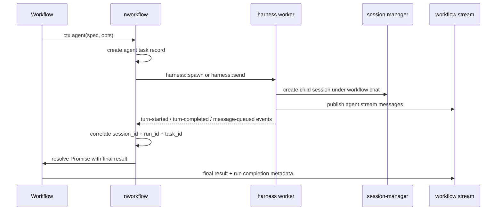

# nworkflow + harness Agent Integration

**Status**: Spezifikation v1.0  
**Datum**: 2026-09-10  
**Ziel**: Einbindung der iii harness-Loop in nworkflow, damit Workflows mit Agenten einfach, deterministisch und stream-überwachbar gestartet werden können.

---

## 1. Ziel

nworkflow soll einen ersten-class Agent-Loop bereitstellen, ohne dass Workflow-Autoren rohe harness-Calls oder Session-Details manuell konfigurieren müssen.

Der Kern ist:

- Workflows können mit einem einfachen Kontext-API Agenten starten.
- Der Agent läuft über den iii `harness` worker.
- nworkflow übernimmt die Lifecycle-Kontrolle: Start, Event-Listening, Result-Resolution, Retry, Timeout, Stream-Bridge.
- Die Conversation/Chat-Context bleibt innerhalb eines Workflows stabil.
- Agent-Nachrichten werden über die vorhandene Workflow-Stream-Session des runs getrackt und verteilt.
- Die DX bleibt sehr einfach: Standard-Defaults, minimale Konfiguration, keine Engine-internen Details im Workflow-Code.

---

## 2. Anforderungen

### 2.1 Functional Requirements

1. `ctx.agent(...)` muss aus einem Workflow-Handler verfügbar sein.
2. nworkflow startet intern einen `harness`-Agent-Lauf als child session / sub-agent.
3. nworkflow hört auf relevante `harness` events und korreliert sie mit dem aktiven Workflow-Run.
4. Agent-Resultate werden an das aufrufende Workflow zurückgegeben, sobald der Agent terminierbar ist.
5. Der Workflow-Chat-Kontext bleibt stabil; der Agent wird als Sub-Session im selben Kontextbaum gestartet.
6. Agent-Nachrichten und Zwischenstände werden über die Workflow-Stream-Session des aktuellen runs publiziert.
7. Entwickler können MCP-Server, Agent-Profile, Skills, Tools, Files, Model-Optionen und andere iii-native Konfigurationen einfach übergeben.
8. Der Agent-Lauf ist durable, rekonstruktionsfähig und kompatibel mit nworkflow's Run/Lifecycle-Modell.
9. Agenten müssen in der UI als eigene Workflow-Bausteine sichtbar sein (Flow View + Run Overview).
10. Der Agent-Fortschritt muss live in der Run-Overview sichtbar sein.
11. Relevante Agent-Konfiguration (Model, Tools, MCP, Limits, Session/Stream-Bindung) muss in der UI transparent einsehbar sein.
12. Ergebnisaufbewahrung für Agent-Steps folgt derselben Return-Policy wie Workflow-Functions: `memory` oder `store`, mit Default `memory`.
13. nworkflow Runtime-Abhängigkeiten (insb. `harness`) müssen als deklarierte Dependencies geführt und bei `iii compose` automatisch mit installiert/provisioniert werden.
14. Live-Status für Runs soll primär stream-basiert sein (kein permanentes Polling erforderlich).
15. Apps müssen sowohl den gesamten Run-Stream als auch selektive Teile (z.B. `agents.*`) abonnieren können.

### 2.2 Non-Goals

- Das direkte Publizieren von rohen `harness::send`-Payloads in Workflow-Code.
- Das Entwerfen eines eigenen Agent-Frameworks innerhalb von nworkflow.
- Das Überschreiben des iii `harness`-Workers oder seiner Semantik.
- Das Ersetzen der normalen Workflow-Queue-/State-Mechanik durch Polling.
- Manuelle, ad-hoc Installation von Pflicht-Dependencies außerhalb des Compose-Provisionings.

---

## 3. Grundidee

nworkflow bleibt der Orchestrator. `harness` bleibt der eigentliche Agent-Lauf. nworkflow kapselt die Komplexität in einer einfachen API.

Der Design-Pfad ist:

- Das Workflow ruft `ctx.agent(...)` auf.
- nworkflow erzeugt aus dem Workflow-Run-Kontext einen Agent-Task.
- nworkflow startet den Agent über `harness::spawn` oder `harness::send`.
- nworkflow verbindet die Agent-Lauf-Session mit dem Workflow-Run.
- nworkflow hört auf `harness::turn-started`, `harness::turn-completed`, `harness::message-queued` und verwandte Events.
- Wenn der Lauf abgeschlossen ist, wird das Resultat in den Workflow-Run geschrieben und an den awaitenden Aufrufer zurückgegeben.

---

## 4. API-Design

### 4.1 Workflow-API

```ts
export default defineWorkflow({
  name: 'agent-test',
  description: 'A simple workflow that processes text with an agent',
  request_format: {
    text: {
      type: 'string',
      description: 'The text to process',
      default: 'Hello World'
    }
  },
  handler: async (input: { text: string }, ctx) => {
    const processed = await ctx.call('process-text', input)

    const agentResult = await ctx.agent({
      prompt: 'Analyse the processed result and propose a concise summary.',
      input: processed,
      agent: 'worker-builder'
    }, {
      model: 'claude-sonnet-4',
      functions: {
        allow: ['*']
      },
      mcpServers: [
        { name: 'github', url: 'https://.../mcp' }
      ],
      files: [
        { path: './docs/brief.md', content: '...' }
      ],
      stream: { enabled: true }
    })

    return agentResult
  }
})
```

### 4.2 Semantische Ziele der API

`ctx.agent(...)` soll immer die gleiche Menge an Intention ausdrücken, egal ob:

- ein einfacher Prompt ohne weitere Tools,
- ein Agent mit MCP-Servern,
- ein Agent mit Dateien/Context-Context,
- ein Agent mit vorgegebenem System-Prompt.

Die erste Parametergruppe ist die fachliche Agent-Definition, die zweite Parametergruppe ist die Lauf-/Runtime-Konfiguration.

---

## 5. Proposed Type Shapes

### 5.1 AgentInvocationSpec

```ts
interface AgentInvocationSpec {
  // 1. Primary intent: what the agent should do
  prompt?: string
  input?: unknown
  message?: string

  // 2. Agent identity / profile
  agent?: string | {
    id?: string
    profile?: string
    model?: string
    systemPrompt?: string
    display?: {
      name?: string
      icon?: 'agent' | 'code' | 'search' | 'terminal' | 'database' | 'test' | 'review' | 'docs' | 'design'
      color?: 'neutral' | 'blue' | 'purple' | 'teal' | 'green' | 'amber' | 'rose'
    }
  }

  // 3. Optional structured task description used by harness
  task?: {
    title?: string
    description?: string
    context?: Record<string, unknown>
  }
}
```

### 5.2 AgentRuntimeOptions

```ts
interface AgentRuntimeOptions {
  model?: string
  provider?: string
  temperature?: number
  maxTurns?: number
  timeoutMs?: number

  functions?: {
    allow?: string[]
    deny?: string[]
    approval?: boolean
  }

  skills?: string[]
  mcpServers?: Array<{
    name: string
    url?: string
    command?: string
    args?: string[]
    env?: Record<string, string>
  }>

  files?: Array<{
    path: string
    content?: string
    mode?: 'read' | 'write' | 'append'
  }>

  systemPrompt?: string
  systemPromptStrategy?: 'enrich' | 'override'

  stream?: {
    enabled?: boolean
    name?: string
    scope?: 'workflow' | 'session' | 'custom'
  }

  session?: {
    reuse?: boolean
    parentSessionId?: string
    allowNewSession?: boolean
  }

  orchestrator?: boolean

  // Ergebnisaufbewahrung wie bei normalen Workflow-Functions.
  result?: {
    returnType?: 'memory' | 'store'
    onMemoryFail?: 'store' | 'error'
  }
}
```

### 5.4 Ergebnisaufbewahrung für Agent-Steps

Die Retention-Semantik für Agent-Ergebnisse ist identisch zu bestehenden Workflow-Function-Ergebnissen:

- `memory`: Ergebnis bleibt nur im In-Memory-Handoff des Runs.
- `store`: Ergebnis wird persistiert und über Ref aufgelöst.

Default:

- Wenn nichts gesetzt ist, gilt auch für Agent-Steps `memory`.

Konsequenz:

- Agent-Tasks sind keine Sonderbehandlung bei Result-Retention, sondern nutzen denselben Mechanismus wie andere Workflow-Steps.

### 5.3 AgentResult

```ts
interface AgentResult {
  status: 'completed' | 'failed' | 'cancelled'
  sessionId: string
  turnId?: string
  output?: unknown
  result?: unknown
  error?: string
  trace?: {
    runId?: string
    turnId?: string
    parentSessionId?: string
  }
  stream?: {
    sessionId: string
    name: string
  }
}
```

---

## 6. Runtime Modell

### 6.1 Lifecycle



### 6.2 Internal Task Record

nworkflow muss pro Agent-Task einen persistierten Datensatz führen:

```ts
interface AgentTaskRecord {
  taskId: string
  runId: string
  workflowSessionId: string
  agentSessionId: string
  parentSessionId?: string
  status: 'pending' | 'running' | 'completed' | 'failed' | 'cancelled'
  createdAt: number
  updatedAt: number
  outputRef?: string
  finalResult?: unknown
  error?: string
  optionsHash: string
  streamName: string
  streamScopeId: string
}
```

Dieser Eintrag ist die Grundlage für:

- Wiederaufnahme nach Crash/Restart,
- Correlation zwischen Workflow-Run und Agent-Session,
- Querying der Agent-Status-API,
- Deduplication bei mehrfachen Events.

Wichtig für Cleanup-Kompatibilität:

- Agent-Task-Records sind run-scoped Artefakte.
- Sie werden nicht über einen separaten Agent-Cleanup-Job gelöscht.
- Das Löschen passiert im gleichen Run-Cleanup-Flow wie alle anderen Run-Artefakte.

---

## 7. Context-Semantik

### 7.1 Chat-Kontext bleibt stabil

Innerhalb eines Workflows gilt:

- `ctx` referenziert immer den aktuellen Workflow-Run-Kontext.
- Ein Agent-Aufruf darf den Chat-Kontext eines Workflows nicht in einen völlig neuen top-level chat kippen.
- Agent-Läufe sind child sessions im gleichen Session-Baum, nicht neue unabhängige Haupt-Sessions.

Daher gilt die Regel:

- `parent_session_id = workflow_session_id`
- `agent_session_id` wird als child session erzeugt, die dem Workflow untergeordnet ist.
- `session_tree` bleibt konsistent.

Damit bleiben:

- Token-Context,
- System-Prompt-Identität,
- Persistent session metadata,
- User-visible conversation lineage

für die gesamte Workflow-Ausführung gleich.

### 7.2 Stream-Session der Workflow-Run ist die Agent-Message-Bridge

nworkflow nutzt die Workflow-Stream-Session als canonical stream scope für Agent-Nachrichten.

```ts
const streamSessionId = workflowRecord.stream_scope_id
const streamName = workflowRecord.stream_name
```

Canonical Stream-Regel:

- Der Stream-Name für Run-Liveevents ist fest `nworkflow`.
- Die Differenzierung erfolgt über `event.type` im Payload (nicht über wechselnde Stream-Namen).

Alle Agent-Events werden dort gepublished:

- agent started
- agent message
- tool call
- tool result
- partial output
- completion
- error

Die Semantik ist:

- Der Stream gehört zum Workflow-Run, nicht zur Agent-Session als eigenständigen top-level channel.
- Der Agent bekommt seine Interaktions-Events über den Workflow-Run-Kontext geliefert.
- Die Agent-Session kann intern separate Session-Events haben; nworkflow bildet sie auf den Workflow-Stream ab.

Das verhindert, dass Agent-Nachrichten in einem separaten, ungebundenen Stream landen und für das Workflow verloren gehen.

### 7.3 Event Envelope und Teil-Subscription

Alle Liveevents (Workflow + Agenten) nutzen ein einheitliches Envelope-Format auf dem canonical Stream:

```ts
interface NworkflowStreamEvent<T = unknown> {
  type: string
  data: T
  run_id: string
  node_uid?: string
  ts_unix_ms: number
}
```

Beispiele für `type`:

- `phase`
- `progress`
- `summary`
- `agents.started`
- `agents.message`
- `agents.tool-call`
- `agents.completed`

Teil-Subscription:

- Full-run: subscribe auf Stream `nworkflow` + `group_id=run_id`.
- Bereichsweise UI:
  - payload-only: `listen('agents.*')`
  - inkl. Event-Metadaten (`type`, `node_uid`, `ts_unix_ms`): `listenEvents('agents.*')`

Damit kann die nvent App UI den gesamten Run live halten, waehrend Custom-Apps nur die benoetigten Teile rendern.

Developer-DX-Regel:

- Ein Subscription-Punkt pro Run (`subscribe({ streamName: 'nworkflow', groupId: runId })`).
- Danach nur noch selektive Projektion ueber Pattern-Filtern statt mehrere technische Stream-Verbindungen pro UI-Bereich.

---

## 8. Event-Integration mit harness

### 8.1 Relevante harness Events

nworkflow hört auf die folgenden iii-native Events:

- `harness::turn-started`
- `harness::turn-completed`
- `harness::message-queued`
- `harness::ready`
- optional: `harness::triggers-changed`, falls später für Agent-Status-Discovery gebraucht wird

### 8.1.1 Event-Namenskonvention (Harness -> nworkflow Stream)

Zur Vereinheitlichung der DX werden Harness-Liveevents auf nworkflow-Stream in feste Event-Namen abgebildet:

- `agents.started`
- `agents.message`
- `agents.tool-call`
- `agents.tool-result`
- `agents.progress`
- `agents.completed`
- `agents.failed`
- `agents.cancelled`

Regeln:

- Eventnamen sind lower-case, dot-separated und prefix-basiert (`agents.*`).
- UI-Bereiche abonnieren Gruppen ueber Prefix-Pattern (z.B. `listenEvents('agents.*')`).
- Neue Agent-Eventtypen sollen unter dem Prefix `agents.` eingefuehrt werden, um Abwaertskompatibilitaet der UI-Filter zu erhalten.

### 8.2 Bindungsmodell

nworkflow bindet beim Start des Workers einen eigenen Listener an, der nach `session_id` / `parent_session_id` / `run_id` filtert.

Die Kernregel:

- Jeder Agent-Task wird mit einer festen `taskId` und `agentSessionId` persistiert.
- Jedes event wird mit `session_id` aufgelöst.
- Wenn `session_id` einer laufenden Agent-Session zugeordnet ist, wird der event-state in den Task-Eintrag übernommen.

### 8.3 Event-Korrelation

```ts
const mapping = {
  [agentSessionId]: {
    runId,
    taskId,
    streamName,
    streamScopeId,
    workflowSessionId
  }
}
```

Diese Tabelle muss in interner State-Storage persistiert werden, damit nach Engine- oder Prozess-Neustart die Agenten korrekt wiederhergestellt werden.

### 8.4 Result-Resolution

Ein Agent gilt als abgeschlossen, wenn ein `harness::turn-completed` für die `agentSessionId` eintrifft mit:

- `terminal: true`
- `status` in `completed | failed | cancelled`

Dann wird:

1. Task-Status aktualisiert.
2. Final-Result in `outputRef` / `result` gespeichert.
3. Workflow-Stream message publiziert.
4. pending Promise aus `ctx.agent(...)` aufgelöst.

5. UI-Status aktualisiert (Flow-Block + Run-Overview), damit terminale und laufende Agent-Zustände sofort sichtbar sind.

---

## 9. Start-Mechanismus

### 9.0 Runtime-Dependencies und Compose-Provisionierung

Da `ctx.agent(...)` technisch auf `harness` basiert, hat nworkflow eine harte Runtime-Abhängigkeit auf den `harness` Worker.

Vertrag:

- nworkflow deklariert `harness` als Dependency.
- `iii compose` provisioniert diese Dependency automatisch mit dem nworkflow Stack.
- Ein separater manueller Install-Schritt für `harness` darf für den Normalfall nicht erforderlich sein.

Versionierung:

- Wenn eine Dependency-Version explizit gesetzt ist, wird diese verwendet.
- Wenn keine Version gesetzt ist, gilt die bestehende Compose-Default-Semantik (`latest`).

Fehlerverhalten:

- Fehlt eine Pflicht-Dependency zur Laufzeit (z.B. `harness`), muss nworkflow einen klaren, diagnosetauglichen Start-/Runtime-Fehler liefern.
- Der Fehler soll die fehlende Dependency benennen und auf Compose-Provisionierung verweisen.

### 9.1 Auswahl zwischen `harness::spawn` und `harness::send`

nworkflow verwendet die semantisch ordentlichste Variante:

- `harness::spawn` für neue Agent-Child-Sessions mit eigener Identität.
- `harness::send` für zusätzliche Nachrichten in einer bereits bestehenden Agent-Session.

#### Entscheidung:

- Wenn `ctx.agent(...)` das erste Mal dieselbe Agent-Instanz startet: `spawn`
- Wenn derselbe Agent-Task weitergesprochen werden soll: `send`

### 9.2 Minimaler Beispiel-Start

```ts
await iii.trigger({
  function_id: 'harness::spawn',
  payload: {
    agent: 'worker-builder',
    message: 'Analyse this input',
    options: {
      model: 'claude-sonnet-4',
      functions: { allow: ['*'] },
      mcp_servers: [...],
      files: [...],
      stream: {
        session_id: workflowStreamSessionId,
        name: workflowStreamName
      }
    },
    parent_session_id: workflowSessionId
  }
})
```

nworkflow darf die Zugriffe in einen adapterisierten, kontrollierten Wrapper verpacken. Das Workflow selbst bleibt auf der einfachen `ctx.agent(...)` Oberfläche.

---

## 10. DX-Design

### 10.1 Ziel

Die Entwickleroberfläche soll so einfach sein, dass ein Workflow-Author nur noch die fachlichen Anforderungen beschreibt, nicht den Harness-Lifecycle.

### 10.2 Good Defaults

`ctx.agent(...)` soll defaults bieten:

- `agent` default: `null` → standard built-in harness identity
- `stream` default: workflow stream session
- `session` default: inherit current workflow session tree
- `functions.allow` default: current workflow default policy
- `timeout` default: workflow timeout or worker default
- `maxTurns` default: reasonable harness default (z.B. 16)
- `mcpServers` default: empty
- `files` default: empty
- `ui` default: agent block sichtbar, kompakte Konfig-Zusammenfassung sichtbar
- `result.returnType` default: `memory`
- `stream.name` default: `nworkflow` (kanonischer Run-Stream)

### 10.3 Beispiel: Einfachster Agent

```ts
const result = await ctx.agent({
  prompt: 'Summarize this report.'
}, {
  model: 'gpt-5-mini'
})
```

### 10.4 Beispiel: Tool-enabled Agent mit MCP

```ts
const result = await ctx.agent({
  prompt: 'Research the repo and propose a fix.',
  input: { repo: 'nvent' }
}, {
  model: 'claude-sonnet-4',
  mcpServers: [{ name: 'github' }, { name: 'filesystem' }],
  functions: {
    allow: ['directory::skills::get', 'directory::system-prompts::get', 'github::*']
  }
})
```

### 10.5 Beispiel: Agent mit Datei-Context

```ts
const result = await ctx.agent({
  prompt: 'Review the implementation against the spec.',
  task: {
    title: 'Code review',
    description: 'Check the patch for correctness and regressions.'
  }
}, {
  files: [
    { path: './specs/harness-agent-workflow-integration.md' }
  ],
  systemPrompt: 'You are a careful reviewer.'
})
```

### 10.6 Beispiel: Agent mit UI-Metadaten

```ts
const result = await ctx.agent({
  prompt: 'Plan the next implementation slice.',
  agent: {
    id: 'planner',
    display: {
      name: 'Planner Agent',
      icon: 'design',
      color: 'teal'
    }
  }
}, {
  model: 'gpt-5-mini',
  maxTurns: 8,
  stream: { enabled: true }
})
```

---

## 11. Sicherheits- und Gating-Regeln

### 11.1 Policy

Der Workflow-Context darf keine privilegierten Funktionen ohne explizite Erlaubnis durch das Workflow-Default-Policy- oder Agent-Options-Set aufrufen.

Regel:

- `Allowlist` muss explizit gesetzt werden, falls der Agent Tools oder Funktionen invoke soll.
- Ohne Erlaubnis: plain chat loop / no tools.

### 11.2 Session-Leakage-Verhinderung

Die Workflow-Session darf nicht durch Agent-Lauf als "neue Haupt-Session" publiziert werden.

Die Agent-Session muss immer als child / sub-agent geführt werden und mit der Workflow-Run-Session verknüpft sein.

### 11.3 Stream-Konsistenz

Agent-Events müssen immer in derselben stream scope auftauchen, die dem Workflow-Run zugeordnet ist; niemals in einem zufälligen, nicht korrelierten Stream.

---

## 12. Error Handling

### 12.1 Fehlerszenarien

1. `harness` nicht verfügbar.
2. `harness::spawn` schlägt fehl.
3. `session_id` nicht nachverfolgbar.
4. Turn timeout.
5. result lost / event drift.
6. agent stream disconnected.

### 12.2 Verhalten

- `ctx.agent(...)` löst mit Fehler-/Status-Objekt aus, nicht nur mit rohen Exceptions.
- `nworkflow` markiert den Agent-Task als `failed` oder `cancelled`.
- Resultatfehler werden in den Run-Record und ggf. in die Workflow-Stream geschrieben.
- Der Workflow-Run bleibt stabil; ein fehlgeschlagener Agent darf den kompletten Run nicht unkontrolliert beschädigen.

---

## 13. Persistenz und Recovery

nworkflow muss Agent-Tasks durable schreiben:

- pending / running / completed / failed
- parent workflow run id
- agent session id
- final result or error
- final stream session
- last known turn id

Dadurch kann nworkflow nach Engine-Neustart den laufenden Agent rekonstruieren und Events korrekt auflösen, ohne dass der Workflow-Run verloren geht.

### 13.1 Cleanup-Integration mit nworkflow Auto-Cleanup

Das Agent-Session-Cleanup muss an das bestehende nworkflow Cleanup-Schema gebunden sein (Retention/Sweep + `run-delete`) und darf keinen eigenen, davon entkoppelten Lebenszyklus haben.

Verbindliche Regel:

- Wenn ein Run durch Auto-Cleanup entfernt wird, werden alle zugeordneten Agent-Sessions und Agent-Task-Records im gleichen Delete-Flow bereinigt.

Reihenfolge (analog zum bestehenden Run-Cleanup-Prinzip: Child-Artefakte zuerst, Run-Record zuletzt):

1. Laufende Agent-Sessions best-effort stoppen (`harness::stop`) für alle offenen `agentSessionId`s.
2. Session-Reverse-Index-Einträge der Agent-Sessions entfernen (`session_id -> run_id`).
3. Agent-Task-Records, Agent-Result-Refs und Event-Correlation-Mappings löschen.
4. Erst danach den Run-Record löschen.

Begründung:

- Der Run-Record ist der Retry-Anchor für vollständige Bereinigung.
- Wird der Run zuerst gelöscht, bleiben Agent-Mappings/Session-Indizes verwaist.
- Idempotente Deletes erlauben sichere Wiederholung im nächsten Sweep-Zyklus bei transienten Fehlern.

Konsequenz für Implementierung:

- Kein eigener TTL-Worker nur für Agent-Sessions.
- Agent-Cleanup wird als fester Teil von `state::delete_run`/`nworkflow::run-delete` modelliert.
- Auto-Cleanup und manuelles `run-delete` nutzen denselben Pfad und damit dieselbe Semantik.

---

## 14. Implementation Notes for nworkflow

### 14.1 Interne nworkflow Funktionen

nworkflow sollte für diese Agent-Integration intern die folgenden Zuständigkeiten haben:

- `nworkflow::agent-start`
- `nworkflow::agent-send`
- `nworkflow::agent-status`
- `nworkflow::agent-cancel`
- `nworkflow::agent-stream-bridge`

Diese Funktionen sind intern und sollten nicht Teil der normalen User-Workflow-Surface sein; die API bleibt `ctx.agent(...)`.

Zusätzlich muss die Worker-Registrierung deklarative Runtime-Dependencies (mindestens `harness`) enthalten, damit Compose den vollständigen Stack automatisch aufbauen kann.

### 14.2 Worker Hooking

nworkflow bindet intern:

- Trigger/Listener auf `harness::turn-completed`
- Trigger/Listener auf `harness::turn-started`
- Trigger/Listener auf `harness::message-queued`

und verwaltet die Correlation zwischen Workflow-Run, Agent-Task und Session-ID.

### 14.3 Workflow-Context API

`ctx.agent` muss die folgenden Regeln einhalten:

- Non-blocking intern in der Workflow-Graph, aber awaitbar für den Handler.
- Aus dem Workflow-Run Sicht deterministisch und robust.
- Keine direkte Nutzung von raw `iii.trigger` in User-Code.

### 14.4 UI-Projection Layer (Flow View + Run Overview)

nworkflow projiziert Agent-Tasks zusätzlich als UI-lesbare Run-Artefakte. Ziel ist eine klare Live-Sicht auf Struktur, Fortschritt und Konfiguration.

Pflichtprojektionen:

1. Flow View
- Jeder `ctx.agent(...)` Aufruf wird als eigener Agent-Block gerendert.
- Der Block zeigt mindestens: `display.name` (oder Fallback), Status-Badge, aktive Runde/Turns, letzte Aktivität, Fehlerzustand.
- Der Block muss visuell unterscheidbar von normalen Function-Nodes sein (eigenes Icon/Farbakzent).

2. Run Overview
- Live-Fortschritt pro Agent: `pending`, `running`, `completed`, `failed`, `cancelled`.
- Fortschrittsindikatoren: gestartete vs. abgeschlossene Agent-Tasks, optional Turns (z.B. `3/8`).
- Zeitdaten: gestartet um, letzte Event-Aktivität, abgeschlossen um, Dauer.
- Der View aktualisiert sich primär aus Stream-Events (Polling nur als Fallback bei Recovery/Gap).

3. Config Visibility
- Pro Agent muss eine kompakte Konfig-Zusammenfassung sichtbar sein:
  - Model/Provider
  - Tool-Policy (`allow`/`deny`)
  - MCP-Server (Namen)
  - Files-Kontext (Anzahl/Quellen)
  - Result-Retention (`memory` oder `store`)
  - Session/Stream-Bindung (`parent_session_id`, stream name/scope)
  - Limits (`maxTurns`, `timeoutMs`)
- Sensitive Felder (z.B. Secrets in env) werden redacted dargestellt.

4. Live Event Bridge
- `harness::turn-started`, `harness::message-queued`, `harness::turn-completed` aktualisieren unmittelbar die UI-Projektion.
- Bei Restart wird die UI aus persistierten Agent-Task-Records + Correlation-Mapping rekonstruiert.
- Alle UI-relevanten Liveevents werden auf dem canonical Stream `nworkflow` publiziert; UI-seitige Teilansichten filtern ueber `type`/Prefix.

Minimales internes UI-Projektionsschema:

```ts
interface AgentUiProjection {
  runId: string
  taskId: string
  agentSessionId: string
  nodeType: 'agent'
  title: string
  status: 'pending' | 'running' | 'completed' | 'failed' | 'cancelled'
  progress?: {
    turn?: { current: number; max?: number }
    startedAt?: number
    updatedAt?: number
    completedAt?: number
  }
  configSummary: {
    model?: string
    provider?: string
    mcpServers?: string[]
    functionAllowCount?: number
    functionDenyCount?: number
    maxTurns?: number
    timeoutMs?: number
    streamName?: string
  }
}
```

Diese Projektion ist UI-orientiert und darf aus den canonical AgentTaskRecords abgeleitet werden; sie ersetzt nicht den orchestratorischen State.

---

## 15. Final Recommendation

Die beste Architektur ist:

- `harness` bleibt das Betriebssystem für die Agent-Loop.
- `nworkflow` bleibt der Orchestrator und Viewer über den Workflow-Run.
- `ctx.agent(...)` ist die einzige Oberfläche, die Workflow-Entwickler sehen.
- `nworkflow` verwaltet die Child-Session, Event-Korrelation, Stream-Bridge und Recovery.
- Der Chat-Kontext bleibt als Workflow-Session-Tree stabil; Agenten sind nur Sub-Agents darin.

Damit entsteht eine einfache, nachvollziehbare und performant skalierbare Agent-Integration, ohne die Workflow-API zu überladen.

---

## 16. Mini-Design-Contract (Kurzfassung)

> In einem nworkflow-Workflow darf ein Agent nie einen eigenen top-level Chat-Kontext erzeugen. Er läuft als Child-Session der Workflow-Session und nutzt die Workflow-Stream-Session als Bridge für Zwischen-Nachrichten. nworkflow übernimmt Event-Korrelation, Recovery und Result-Delivery. Das Cleanup der Agent-Session ist run-scoped und läuft immer im gleichen Auto-Cleanup/Delete-Flow wie der Workflow-Run. Die User-API bleibt `ctx.agent(spec, options)`.

---

## 17. UI-Anforderungen (Normativ)

Die UI-Integration ist kein optionales Nice-to-have, sondern Teil des Laufzeit-Vertrags.

Normative Anforderungen:

- Jeder Agent-Task erscheint im Workflow Flow View als eigener Agent-Block.
- Jeder Agent-Task trägt einen live aktualisierten Status und Fortschrittszustand.
- Die Run Overview zeigt aggregierten Agent-Fortschritt und terminale Fehlerursachen.
- Eine kompakte Agent-Konfig-Zusammenfassung ist pro Task sichtbar.
- Nach Worker/Engine-Restart muss die UI aus persistiertem State rekonstruiert werden.
- Run-Status-Views sollen standardmaessig stream-getrieben sein statt permanenter Fetch-Loops.
- UI-Bereiche koennen selektiv nach Event-Typ/Prefix (z.B. `listen('agents.*')`) abonnieren.

Run-Overview Contract:

- Primärquelle fuer Live-Status ist der nworkflow Stream.
- Polling via `nworkflow::status` dient nur als Fallback (Recovery, Event-Gap, Initial-Snapshot).

Akzeptanzkriterien:

1. Startet ein Workflow mit 3 Agent-Tasks, erscheinen 3 Agent-Blöcke im Flow View.
2. Während Agenten laufen, ändert sich der Status in der Run Overview ohne manuellen Refresh.
3. Fällt ein Agent aus, ist Fehlerstatus inkl. Kontext in Block und Overview sichtbar.
4. Nach Restart bleibt der sichtbare Fortschritt konsistent mit dem rekonstruierten Run-State.

---

## 18. Dependency-Anforderungen (Normativ)

Dependency-Management ist Teil des Runtime-Vertrags.

Normative Anforderungen:

- nworkflow muss alle Pflicht-Dependencies deklarieren (mindestens `harness`).
- `iii compose` muss diese Dependencies beim Provisioning automatisch installieren/starten.
- Ohne deklarierte/verfügbare Pflicht-Dependencies darf `ctx.agent(...)` nicht stillschweigend degradiert werden.

Akzeptanzkriterien:

1. Frisches Environment + `iii compose --up` startet nworkflow inkl. harness ohne manuelle Zusatzinstallation.
2. Entfernt man `harness` künstlich, liefert nworkflow einen klaren Fehler mit Dependency-Hinweis.
3. Dependency-Versionen folgen der Compose-Semantik: explizit gesetzte Version gewinnt, sonst `latest`.
