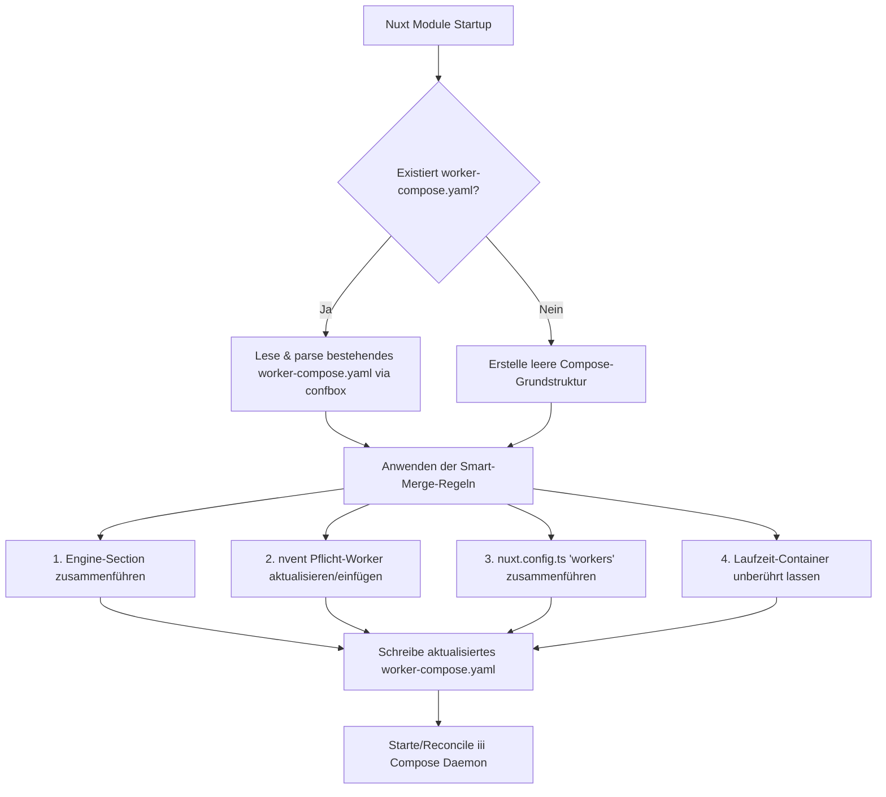

# nvent Spec: iii Compose & Worker Configuration Architecture

**Status**: Spezifikation v1.0  
**Datum**: 2026-09-10  
**Scope**: nvent Nuxt Modul, Compose Runtime Lifecycle, Worker-Registrierung & Konfigurations-Merge  

---

## 1. Context & Problemstellung

Mit der iii 0.23+ Architektur ist **iii Compose** das primäre Betriebssystem für iii-Laufzeiten. Das bisherige nvent-Modul hat jedoch zwei wesentliche Architekturprobleme:

1. **Destruktive Generierung von `worker-compose.yaml`**:
   - Das nvent Nuxt-Modul hat bei jedem Neustart der App (oder HMR) die Datei `.nuxt/nvent/worker-compose.yaml` vollständig überschrieben.
   - Dadurch wurden zur Laufzeit hinzugefügte Container (z. B. via `iii trigger compose::add worker=...` oder interaktiv über das ADE Web-UI) bei jedem Nuxt-Neustart gelöscht.
   
2. **Veraltetes Nuxt-Konfigurationsschema**:
   - Die `nvent.iii`-Konfiguration in `nuxt.config.ts` entstammte der älteren Engine-First-Ära (`wsPort`, `httpPort`, flache Einzelobjekte) und bildete die Flexibilität von iii Compose nicht ab.
   - Entwickler konnten keine zusätzlichen Worker aus der iii Registry (z. B. `llm-router`, `provider-llamacpp`, `session-manager`, custom local `path://...`) sauber über die Nuxt-Config deklarieren.

---

## 2. Zielbild

1. **Non-Destructive Smart Merge für `worker-compose.yaml`**:
   - Beim Start liest nvent eine bestehende `worker-compose.yaml` ein, falls vorhanden.
   - Pflicht-Worker von nvent (`nworkflow`, `state`, `queue`, `cron`, `ade`, `harness`) werden sichergestellt und aktualisiert.
   - Sämtliche zur Laufzeit oder manuell hinzugefügten Container und Engine-Worker bleiben bei Neustart der Nuxt-App erhalten.
2. **Modernes Compose-First Konfigurationsschema in `nuxt.config.ts`**:
   - Entwickler können unter `nvent.iii.workers` (oder `containers`) zusätzliche Worker aus der iii-Registry oder lokale Pfad-Worker deklarativ konfigurieren.
   - nvent dient als eleganter, schlanker Wrapper um iii Compose.
3. **Klare Konfigurations-Priorität (Precedence Hierarchy)**:
   - **Priorität 1 (Höchste)**: Runtime-Änderungen über den iii `configuration`-Worker (`config/<worker>.yaml`) sowie interaktive Container-Hinzufügungen.
   - **Priorität 2**: Explizite Deklarationen in `nuxt.config.ts` (`nvent.iii.workers`, `packageVersions`, etc.).
   - **Priorität 3**: nvent Standard-Defaults für den Betrieb.
4. **Verwendung nativer unjs-Tools**:
   - Einsatz von `defu` und `confbox` für tiefes, typ-sicheres Zusammenführen von YAML-Dokumenten und JSON-Objekten.

---

## 3. Nuxt Konfigurations-Design

### 3.1 `nuxt.config.ts` Schema (`nvent.iii`)

```typescript
export default defineNuxtConfig({
  modules: ['nvent', '@nvent-addon/app'],

  nvent: {
    iii: {
      // Runtime & Versioning
      version: 'iii/v0.23.0',
      failOnInstallFailure: true,
      logLevel: 'debug',

      // Compose Daemon Options
      compose: {
        managed: true,
        file: 'worker-compose.yaml',
        upOnStart: true,
        registrationNamespaceGraceMs: 5000,
      },

      // Managed Standard Services (all enabled by default)
      ade: true,
      harness: true,

      // Additional Custom / Registry Workers
      workers: {
        'llm-router': {
          worker: 'package://api.workers.iii.dev/llm-router',
          version: '1.4.19',
          startAfter: ['state'],
          envFile: ['./.env'],
        },
        'provider-llamacpp': {
          worker: 'package://provider-llamacpp',
          version: '0.3.8',
          startAfter: ['llm-router', 'state'],
        },
        'custom-worker': {
          worker: 'path://./workers/my-worker',
          workingDir: '.',
        }
      },

      // Overrides for default module adapters (State, Queue, Stream, Cron)
      state: {
        adapter: {
          type: 'redis',
          redisUrl: process.env.REDIS_URL || 'redis://localhost:6379'
        }
      },
      queue: {
        queueConfigs: {
          default: { concurrency: 4 },
          heavy: { concurrency: 2, maxRetries: 5 }
        }
      },
      stream: {
        adapter: {
          type: 'redis',
          redisUrl: process.env.REDIS_URL || 'redis://localhost:6379'
        }
      }
    }
  }
})
```

---

## 4. Smart Merge Algorithmus für `worker-compose.yaml`

Wenn das Modul startet und die Compose-YAML generieren bzw. aktualisieren soll:



### 4.1 Merge-Regeln im Detail

1. **Engine Section (`engine`)**:
   - `url`, `workers` (configuration, iii-worker-manager, iii-http-functions, iii-sandbox, iii-stream) werden aktualisiert.
   - Benutzerdefinierte `engineWorkerOverrides` aus der Nuxt-Config werden per Deep-Merge hinzugespielt.

2. **Pflicht-Worker (`containers.nworkflow`, `containers.state`, `containers.queue`, etc.)**:
   - nvent stellt sicher, dass alle notwendigen Kern-Worker vorhanden sind.
   - Falls ein Container bereits in `worker-compose.yaml` existiert, werden dessen Einstellungen (`config_override`, `working_dir`, etc.) behalten und nur fehlende oder in `nuxt.config.ts` explizit überschriebene Schlüssel ergänzt (`defu(nuxtConfig, existingYaml)`).

3. **Benutzer- & Laufzeit-Worker (`containers.<custom>`)**:
   - Jeder Container, der in der bestehenden `worker-compose.yaml` steht (z. B. durch ein `compose::add` während der Laufzeit), **bleibt vollständig erhalten**.
   - Neue Worker aus `nvent.iii.workers` in `nuxt.config.ts` werden hinzugefügt oder aktualisiert.

---

## 5. Umgang mit dem iii `configuration` Worker

Der iii `configuration`-Worker verwaltet dauerhafte Konfigurationsdateien im Verzeichnis `./config/<worker>.yaml` (z. B. `config/queue.yaml`, `config/nworkflow.yaml`).

### 5.1 Regeln für `config/*.yaml` Persistence

1. **Kein automatisches Löschen im Dev-Modus**:
   - Das Verzeichnis `.nuxt/nvent/config/` wird beim Start **nicht** mehr pauschal gelöscht.
2. **Initial Seeding**:
   - Der `configuration`-Worker übernimmt beim ersten Start Einstellungen aus `config_override` in `worker-compose.yaml`.
3. **Laufzeit-Souveränität**:
   - Wenn ein Entwickler oder ein Agent zur Laufzeit Werte über `configuration::set` oder die ADE UI ändert, werden diese in `config/<worker>.yaml` gespeichert und haben Vorrang.

---

## 6. Zusammenfassung der Akzeptanzkriterien

1. **Laufzeit-Erhalt**: Ein per `iii trigger compose::add worker=session-manager` hinzugefügter Worker verschwindet nicht, wenn die Nuxt-App neu gestartet wird.
2. **Nuxt-Config Deklaration**: Worker, die unter `nvent.iii.workers` in `nuxt.config.ts` definiert sind, werden korrekt in `containers:` der `worker-compose.yaml` gerendert.
3. **Keine Datenverluste**: Daten in `data/` und Einstellungen in `.nuxt/nvent/config/` überleben Nuxt-Restarts.
